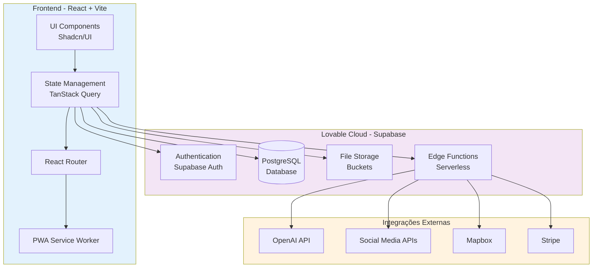
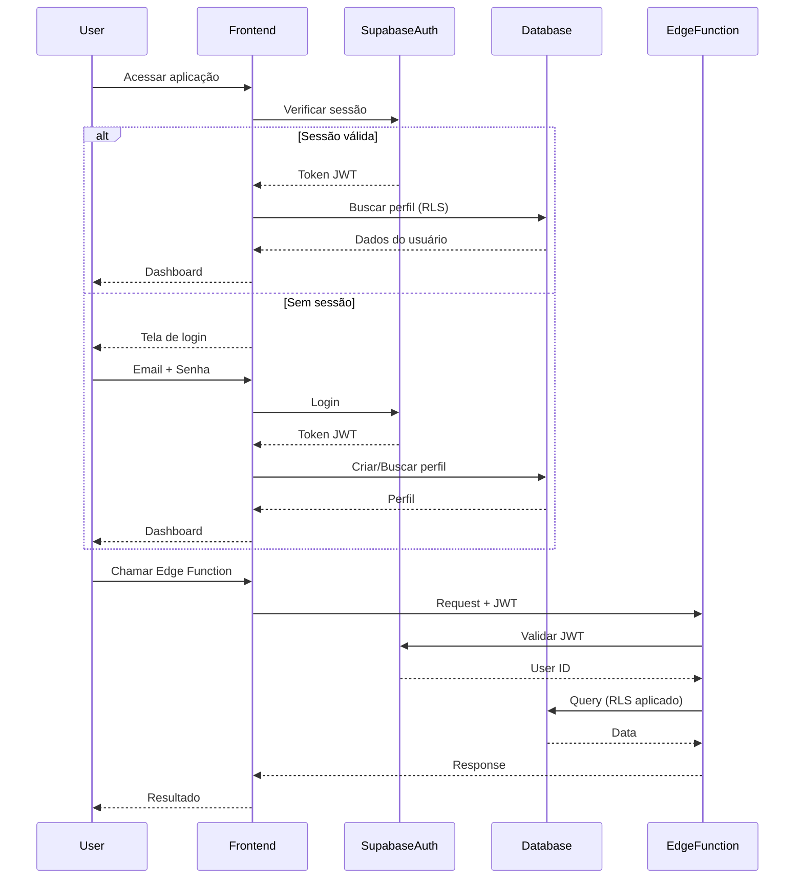
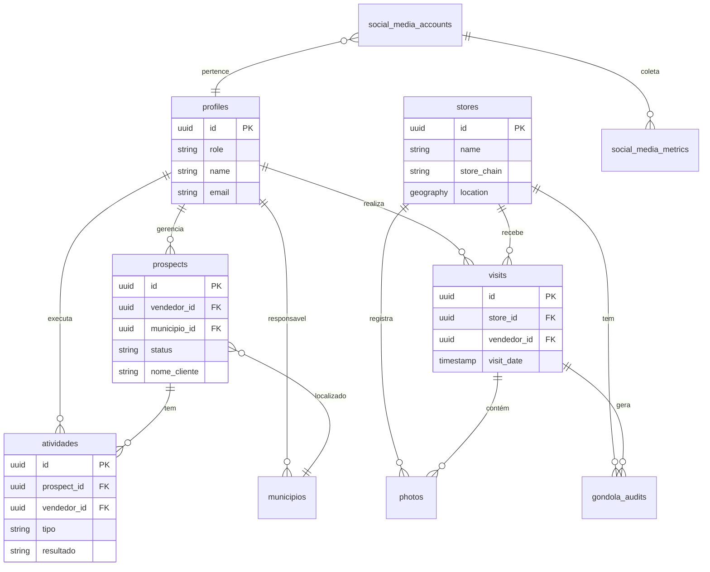
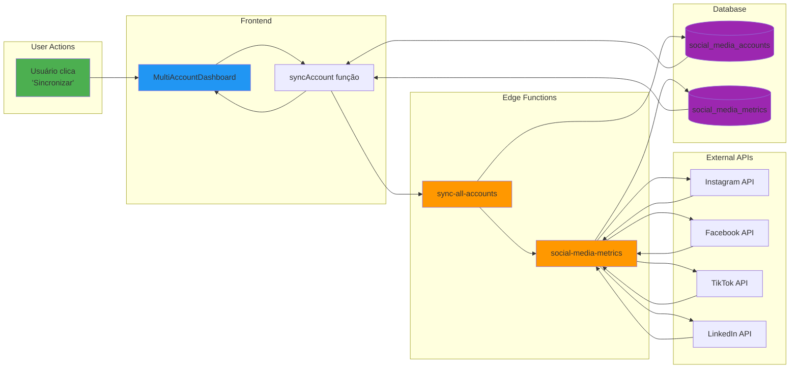
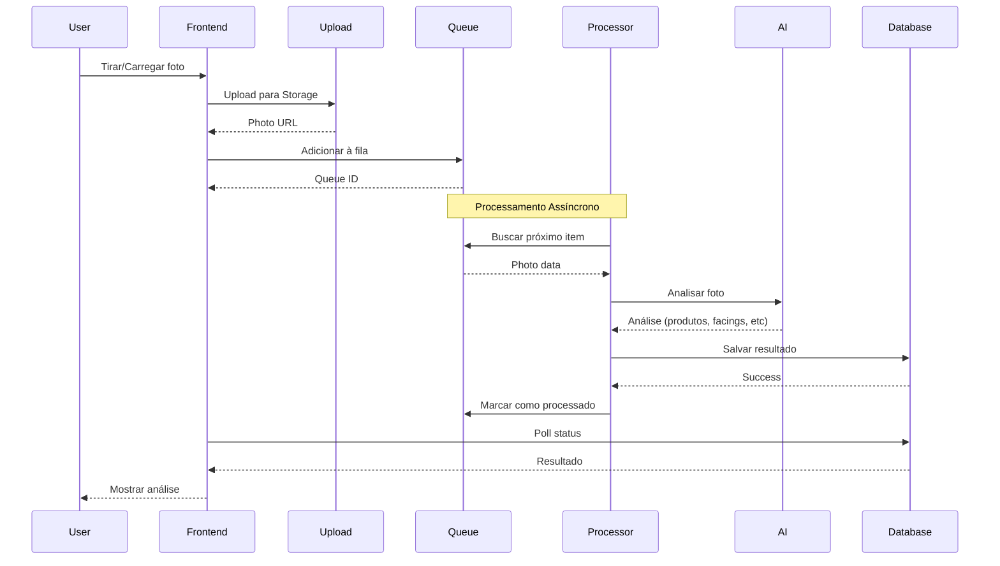
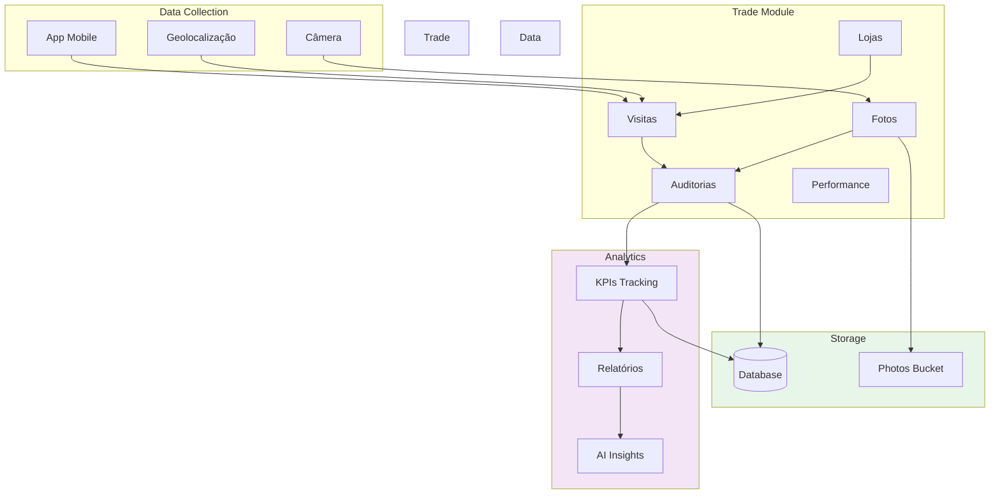
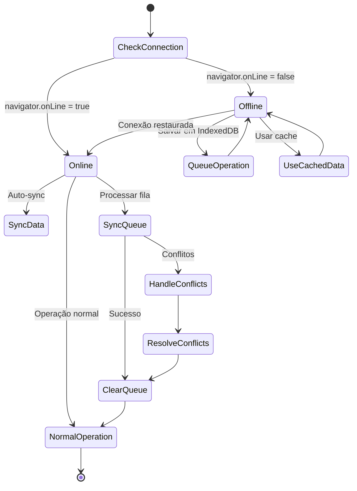
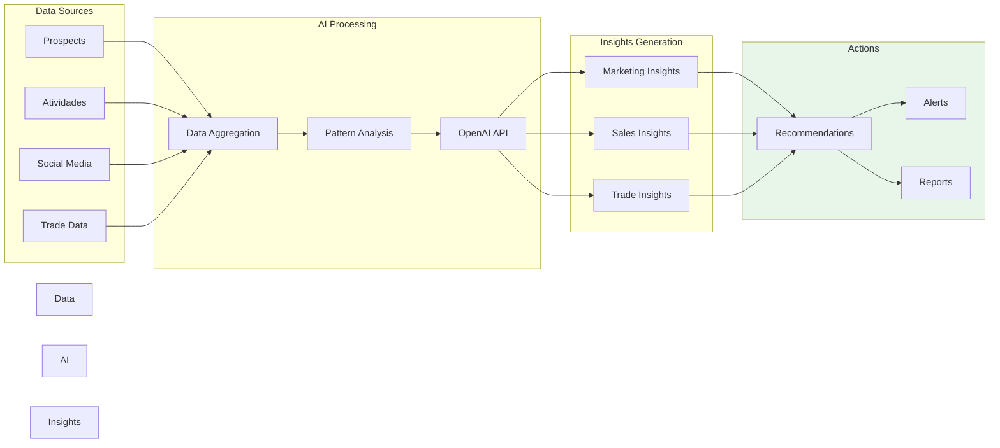
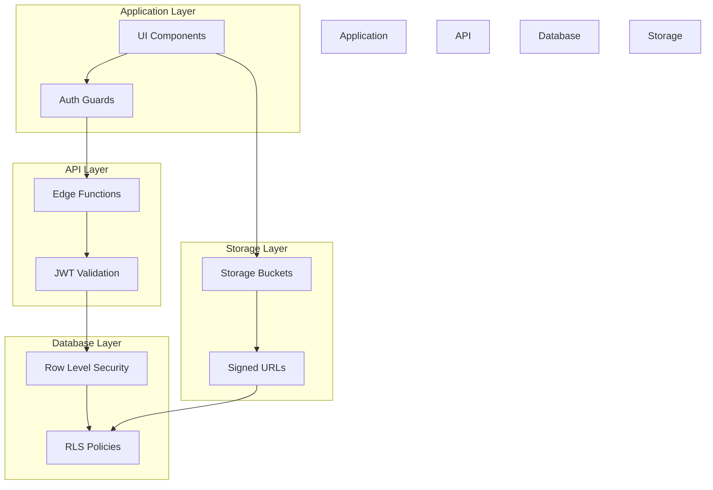
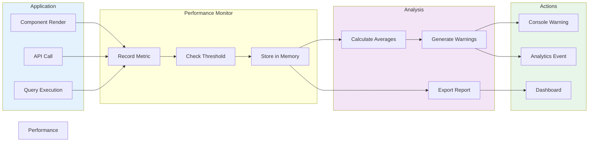

# Diagramas de Arquitetura

Visualizações da arquitetura do BiMaster/Union CRM.

## 🏗️ Visão Geral do Sistema



## 🔐 Fluxo de Autenticação



## 📊 Arquitetura de Dados



## 🔄 Fluxo de Sincronização de Social Media



## 📸 Fluxo de Análise de Fotos



## 🎯 Arquitetura de Trade Marketing



## 🔄 Sistema de Offline/Online



## 🧠 Sistema de IA e Insights



## 🔒 Camadas de Segurança



## 📈 Fluxo de Performance Monitoring



---

## 📚 Convenções de Arquitetura

### Estrutura de Pastas

```
src/
├── components/        # Componentes reutilizáveis
│   ├── ui/           # Componentes base (Shadcn)
│   ├── marketing/    # Módulo de Marketing
│   ├── trade/        # Módulo Trade
│   └── prospects/    # Módulo Prospects
├── pages/            # Páginas/Rotas
├── hooks/            # Custom hooks
├── lib/              # Utilitários
│   ├── utils/        # Funções auxiliares
│   └── validations/  # Schemas Zod
├── integrations/     # Integrações externas
└── test/             # Setup de testes
```

### Padrões de Nomenclatura

- **Componentes**: PascalCase (`UserProfile.tsx`)
- **Hooks**: camelCase com prefixo use (`useUserData.ts`)
- **Utilitários**: camelCase (`formatDate.ts`)
- **Constantes**: UPPER_SNAKE_CASE (`API_ENDPOINTS`)

### Fluxo de Dados

1. **Unidirecional**: Top-down (parent → child)
2. **State Management**: TanStack Query para server state
3. **Local State**: useState/useReducer para UI state
4. **Context**: Apenas para temas, auth, configurações globais

---

**Última atualização:** 2025-01-19  
**Versão:** 1.0.0
